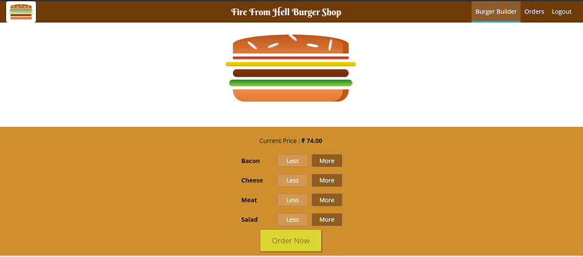
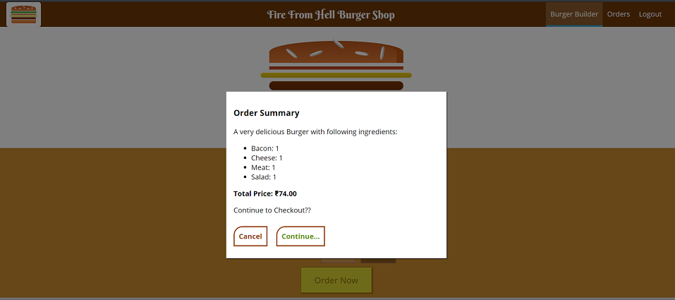
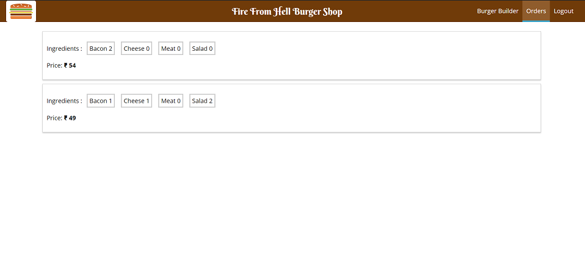

# Burder Builder Shop

A burger making app. Redux for authentication and storing states and using them with action creators and redux-thunk for handing asynchronous node like server request in redux. Used react-router for routing to different components and guarding routes. Used form validation. CSS modulation. Firebase as server for storing user and burger details and also for signIn and signUp user details. Deployed app on firebase.

